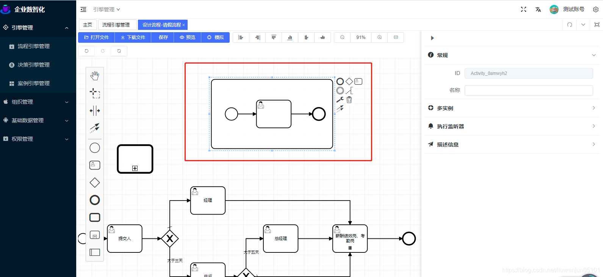
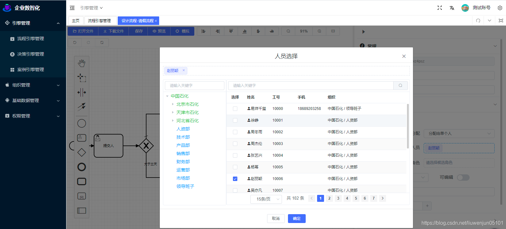
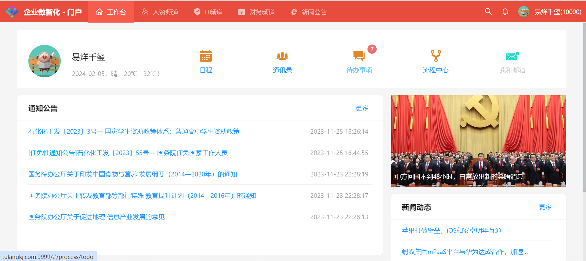

## 预览
- [企业数智化 - 流程中心](http://47.106.196.177:8100/idm/#/login?_blank)
- [企业数智化 - 门户](http://47.106.196.177:8200/idm/#/login)


- [操作演示 - 流程中心](https://www.bilibili.com/video/BV1qU4y1L7pB/)
- [操作演示 - 门户](https://www.bilibili.com/video/BV1mh411Y7UT/)


- [码云](https://gitee.com/lwj/flow)

- [GitHub](https://github.com/ecnice/flow)
### 流程后台-表单设计
  

### 流程后台-流程设计
  
  
  
  
  

### 门户前台
  
  
  
  
  
  


## 后台安装
1、安装数据库
新建一个数据库flow
导入数据库脚本：docs/sql/flow.sql

2、配置数据源
修改flow-admin模块下的resources配置文件application-local.properties
```
spring.datasource.druid.url=jdbc:mysql://localhost:3306/flow?autoReconnect=true&useUnicode=true&characterEncoding=utf8&zeroDateTimeBehavior=CONVERT_TO_NULL&useSSL=false&serverTimezone=GMT%2B8&nullCatalogMeansCurrent=true
spring.datasource.druid.username=xxxx
spring.datasource.druid.password=xxx
```
3、启动应用程序
flow-admin模块下的com.dragon.flow.main.FlowAdminApplication

直接运行即可

4、访问路径
http://localhost:8988/index.html
账号密码：

普通管理员：10101/888888
超级管理员：10100/888888

5、项目结构


6、开放接口
http://localhost:8988/swagger-ui/index.html


## 前台安装
1、配置数据源
修改flow-front-rest模块下的resources配置文件application-local.properties
```
spring.datasource.druid.url=jdbc:mysql://localhost:3306/flow?autoReconnect=true&useUnicode=true&characterEncoding=utf8&zeroDateTimeBehavior=CONVERT_TO_NULL&useSSL=false&serverTimezone=GMT%2B8&nullCatalogMeansCurrent=true
spring.datasource.druid.username=xxxx
spring.datasource.druid.password=xxx
```

2、启动应用程序
flow-front-rest模块下的com.dragon.flow.main.FlowFrontApplication

3、访问路径
http://localhost:8990

4、登录账号密码

账号：10000到10100 密码统一：888888

## Docker 启动
https://gblfy.blog.csdn.net/article/details/117636550
镜像的密码是flow

## 商业版本
商业版本具有强大且更全面的功能，不仅提供组件插件，还提供全套的低代码开发平台。具体核心功能如下：  
1：集成了移动端飞书和钉钉，可在移动端发起流程、审核/查阅待办。  
2：已经实现扩展了几十个流程引擎组件，例如事件管理、多实例、任务管理、网关、服务编排等，后续还会继续扩展。  
3：提供SDK，通过简单的配置即可无缝对接流程引擎相关接口。  
4：文档齐全，提供详细设计说明书、需求规格说明书、用户操作手册、接口文档、数据字典、SDK集成等操作和使用文档，可轻易快速上手。  
5：提供强大的决策引擎功能。
6：提供门户前端代码，门户的数据展示可通过后台动态配置。  
已有多家企业购买与实际业务中使用，如果您有这个兴趣or需求，您可访问以下地址预览查看。  
商业版FlowablePlus流程引擎组件:  
http://www.tulangkj.com
 

商业版后台管理地址：
http://www.tulangkj.com:8888
 
 

商业版前端门户地址：
http://www.tulangkj.com:9999
 

## 联系作者
欢迎bug反馈，需求建议，技术交流等   
QQ扫码入群（群号：633168411）：   
 

## 捐赠
如果您认为该项目对您有所帮助，则可以帮助作者购买一杯咖啡，以表示支持！  


## 协议

- 遵循 MIT 协议
- 请自由地享受和参与开源

## 推荐

大家在使用本项目时，推荐结合贺波老师的书[《深入Activiti流程引擎：核心原理与高阶实战》](https://item.m.jd.com/product/13928958.html?gx=RnAomTM2bmCImZxDqYAkVCoIHuIYVqc)，这本书对系统学习和深入掌握Activiti/Flowable的用法非常有帮助。


